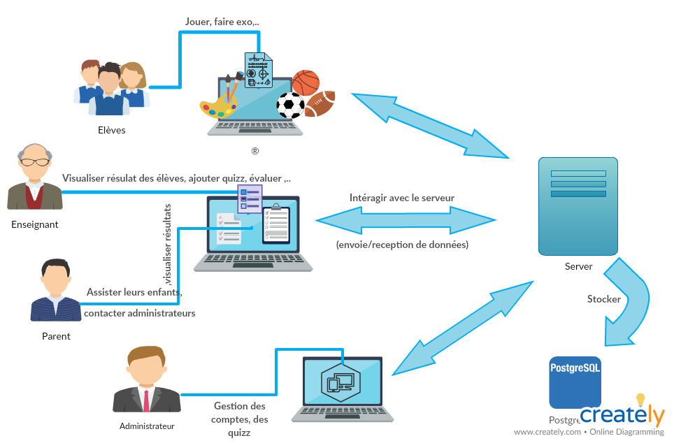
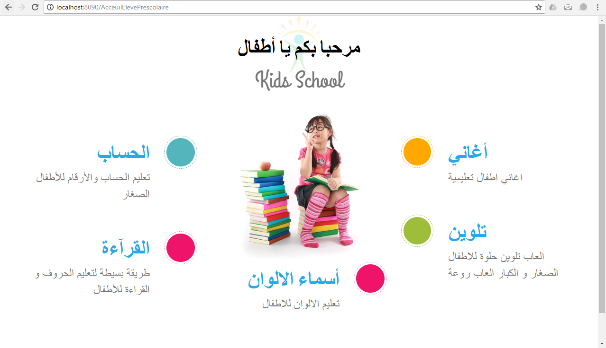
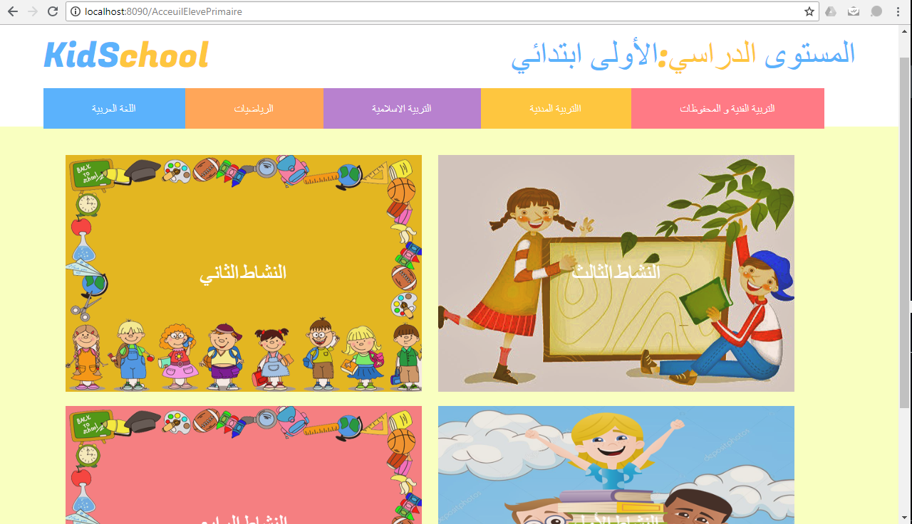
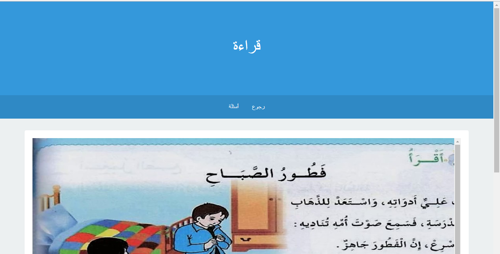
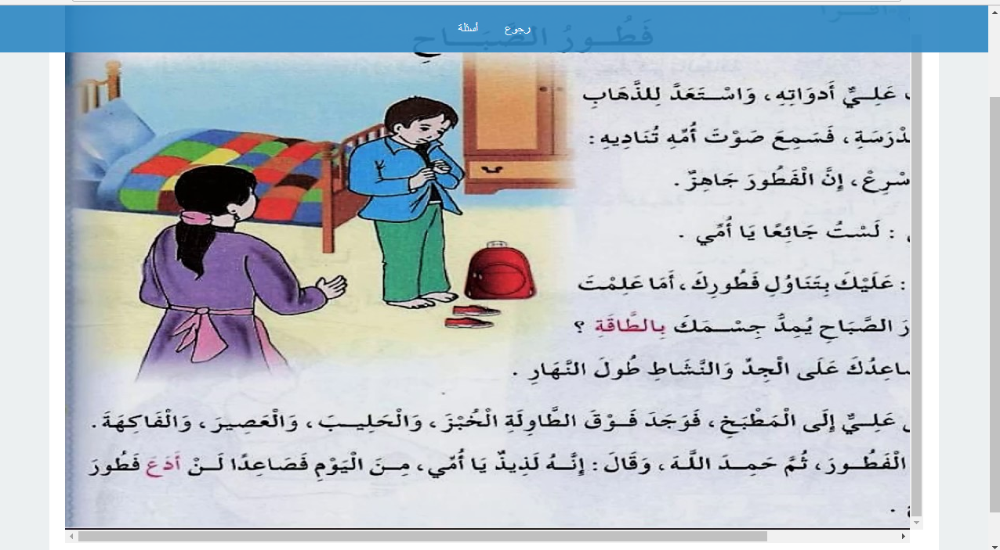
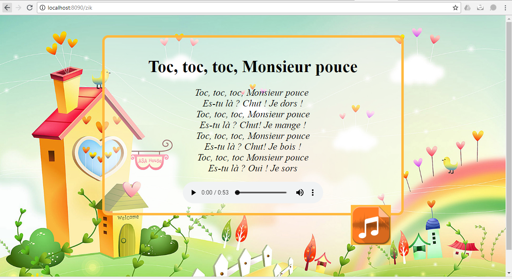
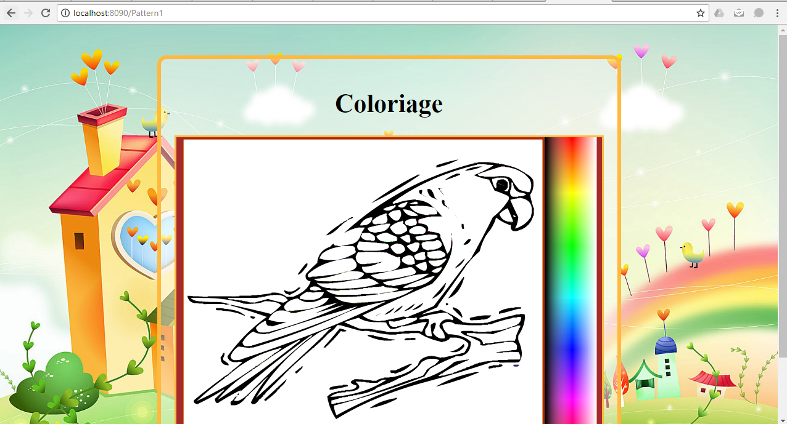
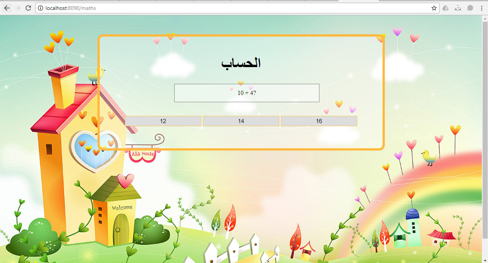

# KidsSchool_ElearningPlateform

C'est une plateforme web d’apprentissage accompagnée d’une base de données. Elle est dédiée aux enfants entre 4 et 8 ans, en exploitant le nouveau concept nommé le « l’apprentissage par les jeux » et en profitant des TIC en éducation, l’enfant peut développer des aptitudes éducatives, sociales et cognitives, une maturité émotionnelle et acquérir suffisamment de confiance en soi pour s'engager dans de nouvelles expériences et de nouveaux environnements.  
Alors l’application est conçue premièrement avec un nombre fixe des quiz, proposés par des enseignants puis validés et intégrés par les développeurs au niveau de la phase de développement.
Cependant, dans des versions plus avancées l’enseignant aura la possibilité d’ajouter ses propres quiz et proposer d’autres exercices qu’il juge utile pour ses élèves.
Il y a une partie du site web dédié à un administrateur pour leur permettre la gestion des différentes demandes et la supervision de toutes les activités.
L’application est conçue pour des acteurs de 4 catégories (Enfants, Parents, Enseignants, Administrateur)

Le schéma global présenté ci-dessous correspond aux différentes acteurs de la plateforme et leurs rôles : 

# Tools used 
PostgreSQL
Eclipse : J2EE, Spring Framework 

# Représentation graphique de quelques interfaces : 

Acceuil d'Eleve Prescolaire

Acceuil d'Eleve Primaire

Interface Matieère Lecture1 

Interface Matieère Lecture2

Interface Prescolaire Chanson

Interface Prescolaire Coloriage

Interface Prescolaire Math

 
